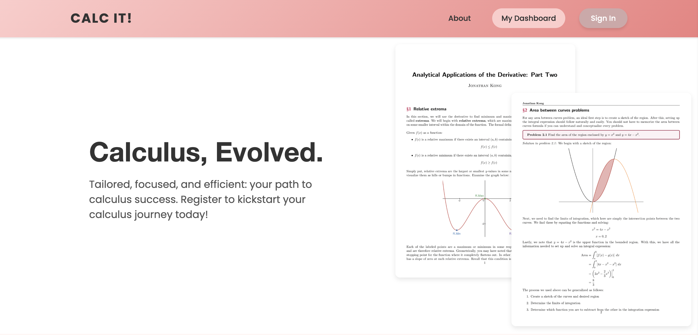
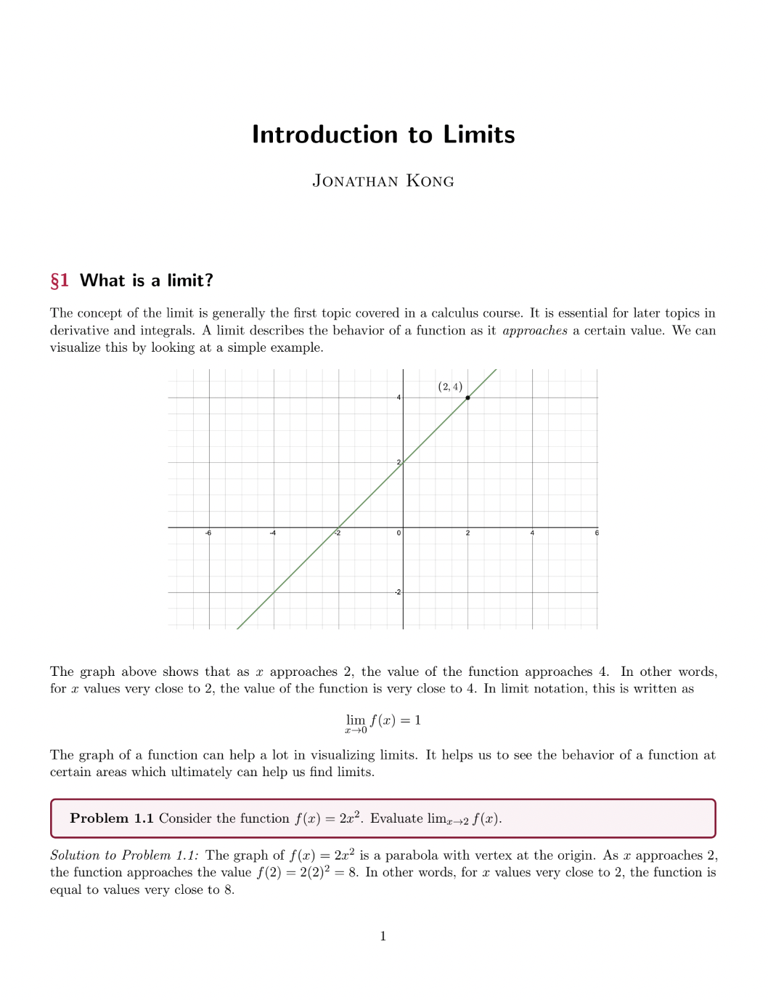
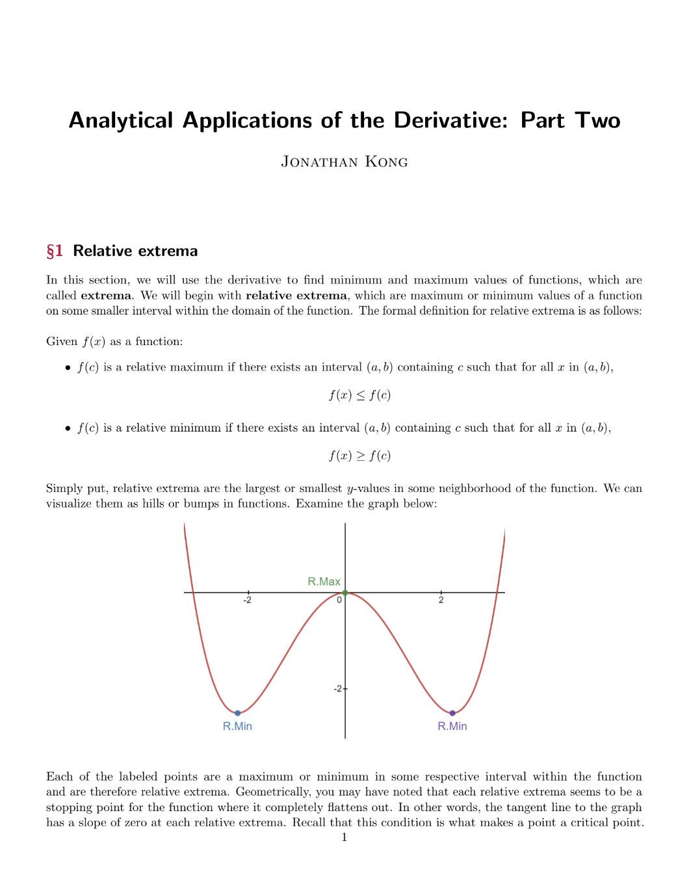
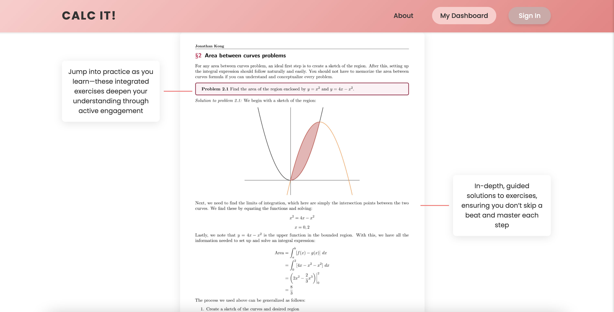
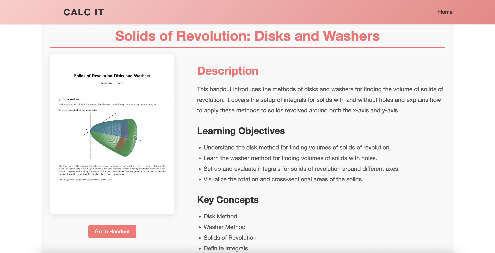
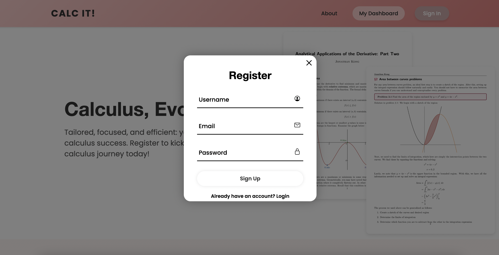
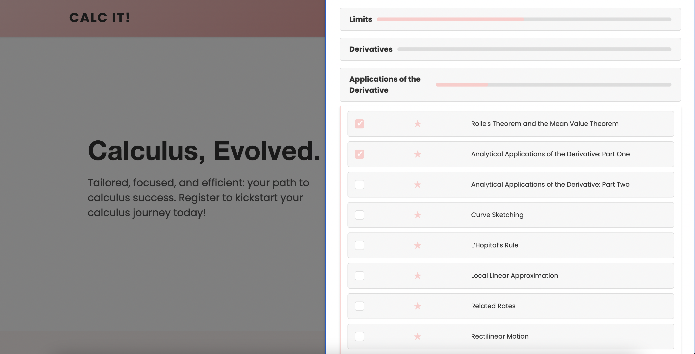

# 
Calc It!

## Motivation

As a student deeply immersed in both mathematics and computer science, I saw firsthand how traditional resources often fall short in teaching complex calculus concepts. Textbooks are often convoluted and lengthy, while online materials are scattered and lack cohesion, leaving students overwhelmed rather than empowered. I recognized the need for a resource that was not only comprehensive but also efficient and user-friendly—a platform that could guide students through calculus with clarity and precision. 

## Project Overview

To address this challenge, I embarked on creating **Calc It!**—a fully interactive calculus learning platform. My goal was to build a centralized resource where students could access well-organized, high-quality learning materials and engage with them meaningfully.

### Building Calc It!

The Calc It! platform was crafted with the following features:

- **User Experience**: Developed with HTML, CSS, JavaScript, and React, the platform ensures accessibility and responsiveness across all devices, making it easy for students to navigate and learn anywhere.
- **Engaging Interactivity**: Features such as progress tracking, bookmarking, and dynamic handout displays are integrated to keep students actively involved in their learning journey.
- **Unique Visual Style**: A cohesive pink gradient theme runs throughout the handouts and website, offering a visually appealing and consistent aesthetic. This design choice enhances readability and creates a modern, inviting learning environment.
- **Reliable Backend**: Utilizing Flask and PostgreSQL, the backend securely handles user authentication, tracks progress, and delivers personalized content and suggestions. 

### Creating the Handouts

The foundation of this project began with the creation of over 30 handouts, totaling more than 150 pages of detailed explanations, examples, and exercises. These handouts were written in LaTeX to ensure they were professionally formatted and easy to navigate. Below are examples of what the LaTeX handouts look like:

  
  

### The Anatomy of Calc It! Handouts

Calc It! handouts were designed with clarity and structure in mind, ensuring that each concept is explained concisely and effectively.

### Integrating the Handouts into the Site

To bring these handouts to life, I developed a comprehensive website that integrates these materials into a user-friendly interface. Here’s what the handouts look like within the platform:

### User Registration/Login and Progress Tracking

Users can easily register and log in to Calc It!, ensuring all their progress is saved and securely stored in the database. The platform keeps track of their bookmarks and the last handout they were working on, offering a seamless experience with features like "Want to continue?" and automatically displaying their last worked-on handout page when they return.

### The Dashboard

The Calc It! dashboard is designed to provide an intuitive overview of your progress, offering quick access to handouts, bookmarks, and more. Here’s what the dashboard looks like:

## Impact

**Calc It!** has since been adopted by 7 Bay Area schools, reaching over 1,000 students. I've also lectured and guest-spoken on its development, blending calculus with web technologies.

## Next Steps

As **Calc It!** continues to grow, I’m excited to focus on:

- **Integrating More Interactive Features**: I would love to introduce quizzes as well as real-time collaboration tools.
- **Scaling the Platform**: My goal is to enhance the infrastructure to support more users and potentially integrate with learning management systems (LMS) to reach a wider audience.

I’m always open to new ideas and collaborations. If you’re passionate about improving calculus education or have suggestions for the platform, I’d love to hear from you!

